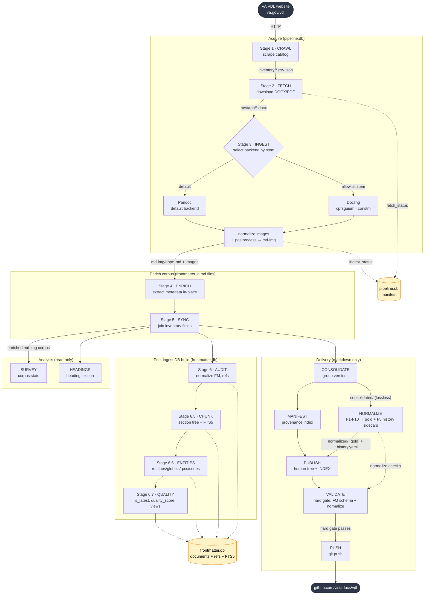

# vista-docs — VDL Pipeline Architecture Overview

## Introduction

`vista-docs` is a TDD Python ETL pipeline that turns the VA VistA Document Library
(VDL) — a sprawling website of DOCX/PDF technical manuals — into a clean, searchable,
cross-referenced markdown corpus published on GitHub.

The pipeline runs in four broad phases:

1. **Acquire** (stages 1–3) — crawl the VDL catalog, download the source DOCX/PDF
   files, and convert them to GitHub-flavored markdown with extracted images. Ingest
   routes per-document between two converter backends: **Pandoc** (the default) and
   **Docling** (an allowlisted few — `cprsguium`, `constm` — whose Word cross-reference
   fields explode into thousands of bare list markers under Pandoc).
2. **Enrich** (stages 4–5) — parse each document and write structured metadata into
   its YAML frontmatter in-place; the enriched corpus then becomes the source of
   truth for everything downstream. Generators sanitize the frontmatter at the source
   (HTML/control-char/mojibake scrubbing, backslash-safe YAML, canonical doc-label and
   package-namespace lookups) so the corpus stays schema-clean by construction.
3. **Index** (stages 6–6.7) — build the `frontmatter.db` SQLite store: normalize
   frontmatter, chunk documents into a section tree with full-text search, extract
   VistA entities (routines, globals, RPCs, codes), and compute quality/latest flags.
4. **Deliver** — consolidate multi-version documents, build a provenance manifest,
   **normalize** the consolidated markdown into clean gold bodies (denoise, recover
   structure, **demote each revision-history table to a `*.history.yaml` sidecar**,
   generate link TOCs, stamp provenance), write a human-browsable publish tree,
   **validate it against a hard frontmatter schema gate**, and push the markdown to
   GitHub.

All output data lives in `~/data/vista-docs/` — never in the repo. Two SQLite stores
hold state: `pipeline.db` (fetch/ingest tracking, stages 1–3) and `frontmatter.db`
(canonical cross-reference store, stages 6–6.7). Revision history lives outside both
stores, in per-document `*.history.yaml` sidecars beside the normalized markdown.

## Contents

- [Mermaid diagram](#mermaid-diagram) — visual end-to-end flow
- [Stage reference table](#stage-reference-table) — every stage: what it does, source, output
- [State stores](#state-stores) — the two SQLite databases and key behaviors

---

## Mermaid diagram

---

## Stage reference table

| # | Stage | What is done | Source | Output |
|---|-------|--------------|--------|--------|
| 1 | **CRAWL** (`vista-docs crawl`) | Scrape the VDL website to discover applications, sections, and documents; build flat + hierarchical catalogs. | VDL website (`va.gov/vdl/`) over HTTP | `inventory/vdl_inventory.csv` (flat), `inventory/vdl_inventory.json` (hierarchical), optional `inventory/snapshots/` |
| 2 | **FETCH** (`vista-docs fetch`) | Download DOCX/PDF for each catalog row, trying candidate URLs; record per-doc status & metadata. | `inventory/vdl_inventory.csv` + VDL file URLs | `raw/{app_code}/*.docx`·`.pdf`; `pipeline.db ▸ manifest` (fetch_status, local_path, fetched_ext, fetch_size) |
| 3 | **INGEST** (`vista-docs ingest`) | Convert DOCX→GitHub-flavored markdown, then normalize image naming (`001.png`…), convert EMF/WMF→PNG, and run the postprocess pipeline. **Backend is selected per-doc by filename stem** (`_select_backend`): `DOCLING_DOCS = {cprsguium, constm}` → **Docling** (reads alt-text from DOCX XML, injects image refs — avoids the `[[…]]` cross-ref bare-marker explosion); everything else → **Pandoc** (`gfm`, `--extract-media`). Docling is an optional extra (`pip install vista-docs[docling]`). | `raw/{app_code}/*.docx` + Pandoc / Docling | `md-img/{app_code}/{stem}.md` + `{stem}/NNN.png`; `pipeline.db ▸ manifest` (ingest_status, markdown_path) |
| 4 | **ENRICH** (`vista-docs enrich`) | Parse markdown body; extract metadata (word/page count, revision history, stub flag, security keys, menu options, keywords, package ns/version, audience…) and populate YAML frontmatter in-place. Sanitizes scalar fields at the source (strip HTML/markdown/control chars, fix cp1252 mojibake), backslash-escapes YAML-emitted strings, and applies canonical lookups: `doc_type`→`doc_label` (`enrich/doc_labels.py`, from `data/doc_labels.yaml`) and package abbrev→canonical name + `pkg_ns` (`enrich/package_master.py`, from `data/package_master.yaml`). | `md-img/{app_code}/*.md` | Same files, frontmatter fully populated + schema-clean in-place |
| 5 | **SYNC** (`vista-docs sync`) | Join inventory metadata (app_name, section, doc_type, pub_date) from the enriched CSV into each doc's frontmatter. | `inventory/vdl_inventory_enriched.csv` + `md-img/**/*.md` | Same files, inventory fields appended in-place |
| 5+ | **SURVEY** (`vista-docs survey`) | Analyze the enriched corpus; emit per-doc metrics, stub list, and corpus-wide aggregates. | `md-img/**/*.md` | `survey/survey-enrichment.csv`, `survey/survey-stubs.csv`, `survey/survey-summary.json` |
| 5+ | **HEADINGS** (`vista-docs headings`) | Compute heading frequency by doc type; classify headings BOILERPLATE / COMMON / UNIQUE. | `md-img/**/*.md` | `survey/heading_analysis/{doc_type}.json`, `_lexicon.json`, `summary.md`, `lexicon_stats.md` |
| 6 | **AUDIT FRONTMATTER** (`pipeline/audit_frontmatter.py`) | Robust-parse + normalize frontmatter; strip duplicate Pandoc title blocks; fix cp1252↔UTF-8 mojibake; re-extract file numbers / security keys / menu options; fill empty description+audience; rewrite canonical key order; stamp `audit_applied`. | `md-img/{app_code}/*.md` | Files normalized in-place; `frontmatter.db`: `documents`, `doc_file_refs`, `doc_security_keys`, `doc_keywords`, `audit_issues`, `audit_mtimes` |
| 6.5 | **CHUNK SECTIONS** (`pipeline/chunk_sections.py`) | Parse ATX heading hierarchy into a parent-linked section tree; build an FTS5 full-text index for hybrid search. | `md-img/{app_code}/*.md` | `frontmatter.db`: `doc_sections`, `doc_sections_fts` (FTS5), `doc_section_mtimes` |
| 6.6 | **EXTRACT ENTITIES** (`pipeline/extract_entities.py`) | Conservatively regex-extract VistA entities (RPCs, routines `TAG^RTN`, menu options, globals `^GLOBAL`, terminology codes LOINC/ICD-10/RXCUI/SNOMED/CPT) with strong local context. | `md-img/{app_code}/*.md` | `frontmatter.db`: `doc_routines`, `doc_globals`, `doc_options`, `doc_rpcs`, `doc_codes`, `doc_entity_mtimes` + coverage views |
| 6.7 | **APPLY QUALITY VIEWS** (`pipeline/apply_quality_views.py`) | Pure SQL: parse `patch_num_int`; mark `is_latest` per group_key; compute composite `quality_score` (0–100); create convenience views. | `frontmatter.db` (all prior tables) | `documents.{patch_num_int, is_latest, quality_score}`; views `v_doc_enriched`, `v_group_latest`, `v_app_latest` |
| 8 | **CONSOLIDATE** (`vista-docs consolidate`) | Group multi-version docs by (app_code, doc_type, normalized title); merge into a master with prior versions appended as appendices + provenance frontmatter. | `md-img/**/*.md` | `consolidated/{app_code}/{doc_type}/{title}.md` (+ images); `consolidated/consolidation_summary.md` |
| 9 | **MANIFEST** (`vista-docs manifest`) | Build the provenance index: map each source doc to its role (anchor/patch/plain) and its consolidated master, with SHA-256. | `md-img/**/*.md` (consolidation logic inline) | `migration/corpus-manifest.json` |
| 9.5 | **NORMALIZE** (`vista-docs normalize`) | Convert the lossless `consolidated/` tree into clean gold markdown (F1 denoise, F2 header/footer strip, F3 heading inference + F3a unwrap dead nav-link wrapping, F4 GitHub-slug anchors + alias map, **F5 parse the revision-history table (HTML or GFM-pipe dialect), demote it to a `*.history.yaml` sidecar, drop the table from the body, set `revision_sidecar` in FM, and de-pollute `description` of any revision-caption text**, F6 generate link TOC + drop the original pandoc TOC, F9 figure captions, F10 table policy, F8 link rewrite + dead-link sweep). Stamps provenance (`source_sha256`, `converter`, `normalized_at`, `normalize_version`); emits `survey/anchor_index.json`; idempotent + reversible. | `consolidated/**/*.md` (never mutated), `raw/` (for sha256) | `normalized/{app}/{doc_type}/{title}.md` + `{stem}.history.yaml` sidecars (`document`, `source_docx`, `revisions[]={date,version,pages,change,refs}`); `survey/anchor_index.json`, `survey/normalize_validation_flags.csv` |
| 10 | **PUBLISH** (`vista-docs publish`) | Write the human-browsable tree: anchor docs at `{section}/{pkg}/`, patches under `patches/`, images copied alongside; build top-level `INDEX.md`. **Prefers `normalized/` gold bodies** when present (per-doc fallback to `consolidated/`; images always from `consolidated/`). | `normalized/` (if present), `consolidated/`, `md-img/`, `migration/corpus-manifest.json`, `inventory_enriched.csv` | `publish/{section}/{pkg}/*.md` + images; `publish/INDEX.md`; `.gitignore` (binary images) |
| 10+ | **VALIDATE** (`vista-docs validate`) | Validate every doc's frontmatter against two layers: **(1) pure rules** — 7 required keys (`title, doc_type, doc_label, app_code, app_name, section, pkg_ns`), `section ∈ {CLI,FIN,GUI,INF,MON}`, scalar fields free of HTML / C0 control chars / mojibake, no legacy-only schema; **(2) the draft-07 JSON schema** (`validate/frontmatter.schema.json`, `additionalProperties:false`) for types + enums — plus the normalize checks (dead-anchor, noise, sidecar integrity) over `normalized/`. **Hard** violations block publish/push; **soft** violations (type drift, unknown keys) are advisory-only. The same gate runs automatically post-`publish` (skip with `--no-validate`) and is **non-optional before `push`**. | `publish/` (optionally `md-img/`), `normalized/` | `survey/publish_validation_flags.csv`, `survey/normalize_validation_flags.csv`; non-zero exit on hard failure |
| 11 | **PUSH** (`vista-docs push`) | Regenerate publish tree, then commit & push markdown-only to GitHub (images excluded via `.gitignore`). | `publish/` | Commit on `origin/main` → `git@github.com:vistadocs/vdl.git` |

---

## State stores

| Store | Stages | Role | Key contents |
|-------|--------|------|--------------|
| `state/pipeline.db` | 1–3 | Acquisition tracking | Single `manifest` table: doc identity, URLs, fetch_status/local_path/fetched_ext/fetch_size, ingest_status/markdown_path |
| `state/frontmatter.db` | 6–6.7 | Canonical cross-reference store | `documents`; section tree `doc_sections` + `doc_sections_fts` (FTS5); reference tables `doc_file_refs`, `doc_security_keys`, `doc_keywords`, `doc_routines`, `doc_globals`, `doc_options`, `doc_rpcs`, `doc_codes`; mtime caches; `audit_issues`; coverage + enrichment views |

**Notes**

- After Stage 4, **markdown frontmatter is the source of truth** for metadata; the
  `frontmatter.db` tables are derived cross-references/views built over the corpus.
- Stages 6–6.6 are **incremental** (skip unchanged docs via mtime cache tables);
  Stage 6.7 is pure SQL and always re-runs.
- All stages are **idempotent** — re-runnable without destroying prior output (use
  `--force` to override skip/incremental behavior).
- **Ingest backend is per-document**: Pandoc by default, Docling only for the
  allowlisted stems in `DOCLING_DOCS` (`ingest/converter.py`). Docling is an optional
  install extra (`vista-docs[docling]`); the lazy import fails loudly if a routed doc
  is ingested without it.
- **Frontmatter is schema-guarded end to end**: generators emit schema-clean YAML
  (canonical labels/namespaces, sanitized scalars, round-trip-safe `safe_dump`), and
  the VALIDATE hard gate makes it **impossible to publish or push a corpus with
  broken frontmatter**.
- **Revision history is demoted out of the body** into per-document `*.history.yaml`
  sidecars during NORMALIZE (F5); the markdown keeps only a `revision_sidecar`
  pointer in its frontmatter.
- `--pkg` always takes the VDL `app_code` (CPRS, ADT, PSO), **not** the VistA M
  namespace (OR, DG, PSO).
